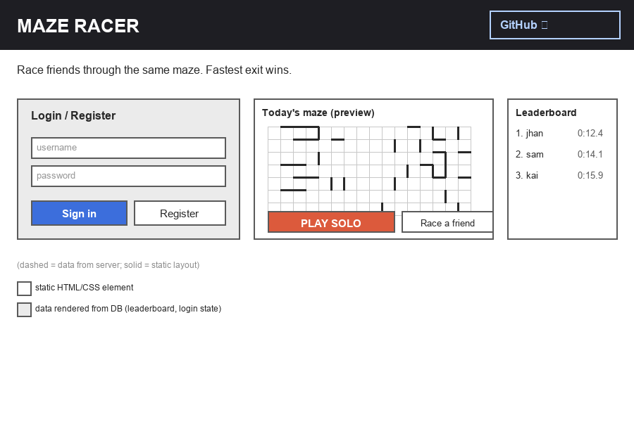
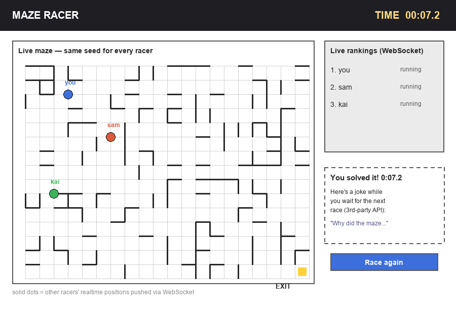

# Maze Racer

This `README.md` documents my startup application for BYU CS 260. It follows the pattern from the [startup-example](https://github.com/webprogramming260/startup-example) repo: the sections below describe the application as a whole, and each deliverable gets its own checklist section (further down) describing what was actually completed for that milestone, referencing the grading rubric.

## Specification

### Elevator pitch

Ever crushed a word puzzle before your coffee finished brewing and wanted a race with more bite? Maze Racer drops you and your friends into the exact same procedurally generated maze at the exact same instant — first one to the exit wins, and you can watch everyone else's marker scrambling through the walls in real time. No two mazes repeat, so there's always a new one to beat, and a persistent leaderboard keeps score of who's actually the fastest in the group. It's the daily-puzzle stickiness of Wordle combined with the head-to-head thrill of a live race — simple enough to learn in five seconds, competitive enough to keep people coming back.

### Design

Home screen — login/register, today's maze preview, and the leaderboard:

Live race screen — the maze, opponents' realtime positions, and the post-win screen:

### Key features

- Instant, procedurally generated maze (a new random layout every game, generated with a recursive-backtracker algorithm)
- Solve solo against the clock, or race friends on the identical maze at the same time
- Live tracking of every racer's position and rank as they move through the maze
- Secure account registration/login so scores are tied to a real player
- Persistent leaderboard of best solve times
- A small reward (a joke fetched from a public API) shown after finishing a race

### Technologies

I am going to use the required technologies in the following ways:

- **HTML** - Structural pages for login/registration, the home/lobby screen (maze preview + leaderboard), and the maze race screen.
- **CSS** - Grid-based layout for rendering the maze walls, responsive layout for the lobby and race screens, and simple animation for racer markers moving through the maze.
- **React** - Components for the login form, the maze grid, the live rankings sidebar, and the leaderboard, with React Router switching between the lobby, an active race, and the post-race screen.
- **Service** - Backend Node/Express endpoints for:
  - register, login, logout
  - generate a new maze (returns a seed so every racer gets the identical layout)
  - save a completed race time
  - get the leaderboard
  - a call to the third-party [icanhazdadjoke.com](https://icanhazdadjoke.com/api) API (no auth required, supports CORS/HTTPS) to fetch a joke shown after a player finishes a race
- **DB** - MongoDB storing user accounts/credentials, maze seeds, and race results used to build the leaderboard.
- **WebSocket** - While a race is active, each racer's position updates are broadcast to every other racer in that race so everyone sees live movement and live rankings without refreshing.

## Specification Deliverable

For this deliverable I did the following:

- [x] I completed the prerequisites for this deliverable (Git commit requirement)
- [x] Proper use of Markdown
- [x] A concise and compelling elevator pitch
- [x] Description of key features
- [x] Description of how I will use each technology
- [x] One or more rough sketches of my application (embedded above using Markdown image references)
